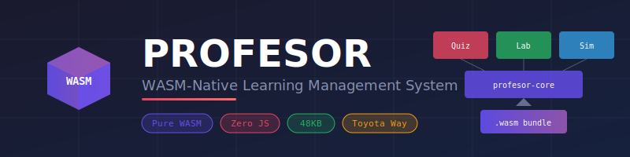

<p align="center">
  
</p>

<p align="center">
  <a href="https://github.com/paiml/profesor/actions"></a>
  <a href="https://crates.io/crates/profesor"></a>
  <a href="https://docs.rs/profesor"></a>
  <a href="LICENSE"></a>
</p>

# Profesor

**WASM-native learning management system** built on Toyota Way principles. Delivers Coursera-like functionality (courses, quizzes, labs, simulations) compiled entirely to WebAssembly with zero JavaScript dependencies.

## Features

- **Pure WASM** - Compiles to `wasm32-unknown-unknown` with no JS runtime
- **Zero JavaScript** - No JS dependencies, smaller bundles, better security
- **48KB Bundle** - Optimized release build with LTO and size optimization
- **Offline-First** - Works without network connectivity
- **Instant Feedback** - Sub-millisecond response times (Jidoka principle)
- **no_std Compatible** - Works in any WASM environment

## Toyota Way Principles

Profesor implements four key principles from the Toyota Production System:

| Principle | Manufacturing | Learning |
|-----------|--------------|----------|
| **Jidoka** | Stop on defects | Immediate feedback on errors |
| **Poka-Yoke** | Mistake-proofing | Structured exercises prevent confusion |
| **Kaizen** | Continuous improvement | Progressive learning in small steps |
| **Mieruka** | Visual management | Physics simulations & progress dashboards |

## Installation

### As a Rust Dependency

```toml
[dependencies]
profesor = "0.1"
```

### From Source

```bash
git clone https://github.com/paiml/profesor.git
cd profesor
cargo build --release
```

### WASM Build

```bash
# Install WASM target
rustup target add wasm32-unknown-unknown

# Build optimized WASM bundle
cargo build --target wasm32-unknown-unknown --release -p profesor

# Output: target/wasm32-unknown-unknown/release/profesor.wasm (48KB)
```

## Quick Start

### Quiz Engine

```rust
use profesor::{Quiz, QuizEngine, Question, QuestionId, Answer};

// Create a quiz
let quiz = Quiz::new("rust-101", "Rust Basics")
    .with_passing_score(0.7)
    .with_question(Question::MultipleChoice {
        id: QuestionId::new("q1"),
        prompt: "What keyword declares an immutable variable?".into(),
        options: vec!["let".into(), "var".into(), "const".into()],
        correct: 0,
        explanation: "In Rust, 'let' declares variables (immutable by default).".into(),
        points: 10,
    });

// Run the quiz
let mut engine = QuizEngine::new(quiz);
let question = engine.start()?;
let feedback = engine.submit_answer(Answer::Choice(0))?;

println!("Correct: {} - {}", feedback.correct, feedback.explanation);
```

### Physics Simulation

```rust
use profesor::{PhysicsWorld, RigidBody, Vec2};

// Create a physics world
let mut world = PhysicsWorld::new()
    .with_gravity(Vec2::new(0.0, 9.81))
    .with_bounds(0.0, 0.0, 800.0, 600.0);

// Add a bouncing ball
let ball = RigidBody::new(400.0, 100.0)
    .with_mass(1.0)
    .with_restitution(0.9);
world.add_body(ball);

// Simulate physics
for _ in 0..60 {
    world.step();
    println!("Ball position: ({}, {})",
        world.bodies[0].position.x,
        world.bodies[0].position.y);
}
```

### Course Structure

```rust
use profesor::{Course, Module, Lesson, LessonContent, CourseLevel};

let course = Course::new("rust-fundamentals", "Rust Programming")
    .with_level(CourseLevel::Beginner)
    .with_module(
        Module::new("basics", "Getting Started")
            .with_lesson(
                Lesson::new("hello", "Hello World")
                    .with_duration(15)
                    .with_content(LessonContent::Text("...".into()))
            )
    );
```

## Examples

Run the interactive demos:

```bash
# Quiz engine with immediate feedback (Jidoka)
cargo run --example quiz_demo -p profesor

# Physics simulation with visualization (Mieruka)
cargo run --example physics_demo -p profesor

# Course structure with progressive learning (Kaizen)
cargo run --example course_demo -p profesor
```

## Architecture

```
┌─────────────────────────────────────────────────────────┐
│                  PROFESOR WASM BUNDLE                    │
│                                                          │
│  ┌─────────────┐  ┌─────────────┐  ┌─────────────┐      │
│  │ profesor-   │  │ profesor-   │  │ profesor-   │      │
│  │   quiz      │  │    lab      │  │    sim      │      │
│  └─────────────┘  └─────────────┘  └─────────────┘      │
│                                                          │
│                    PROFESOR-CORE                         │
│              Types · Traits · Serialization              │
└─────────────────────────────────────────────────────────┘
```

### Crates

| Crate | Description |
|-------|-------------|
| `profesor-core` | Shared types, IDs, course/quiz/lab structures |
| `profesor-quiz` | Quiz engine with state machine and grading |
| `profesor-lab` | Lab runner with sandboxed execution |
| `profesor-sim` | Physics engine and state machine simulations |
| `profesor` | Facade crate with WASM FFI exports |

## WASM Integration

The library exports C-compatible FFI functions for browser integration:

```c
// Memory management
uint8_t* alloc_bytes(size_t len);
void free_bytes(uint8_t* ptr, size_t len);

// Quiz engine
QuizHandle quiz_create_sample();
int32_t quiz_start(QuizHandle handle);
int32_t quiz_submit_choice(QuizHandle handle, uint32_t choice);
int32_t quiz_finish(QuizHandle handle);

// Physics engine
PhysicsHandle physics_create();
void physics_add_body(PhysicsHandle handle, float x, float y);
void physics_step(PhysicsHandle handle);
```

## Documentation

- [The Profesor Book](book/) - Comprehensive TDD documentation
- [API Reference](https://docs.rs/profesor) - Rust API documentation
- [Examples](crates/profesor/examples/) - Runnable code examples

## Testing

```bash
# Run all tests (156 tests)
cargo test

# Run with coverage
cargo llvm-cov --html

# Run clippy lints
cargo clippy -- -D warnings

# Check formatting
cargo fmt --check
```

## Benchmarks

```bash
# Run benchmarks
cargo bench

# Profile WASM size
ls -lh target/wasm32-unknown-unknown/release/profesor.wasm
```

## Contributing

Contributions are welcome! Please read our [Contributing Guide](CONTRIBUTING.md) for details.

1. Fork the repository
2. Create a feature branch (`git checkout -b feature/amazing-feature`)
3. Commit your changes (`git commit -m 'Add amazing feature'`)
4. Push to the branch (`git push origin feature/amazing-feature`)
5. Open a Pull Request

## License

This project is licensed under the MIT License - see the [LICENSE](LICENSE) file for details.

## Acknowledgments

- Built with the [PAIML Sovereign AI Stack](https://github.com/paiml)
- Inspired by Toyota Production System principles
- Designed for the modern web with pure WebAssembly
